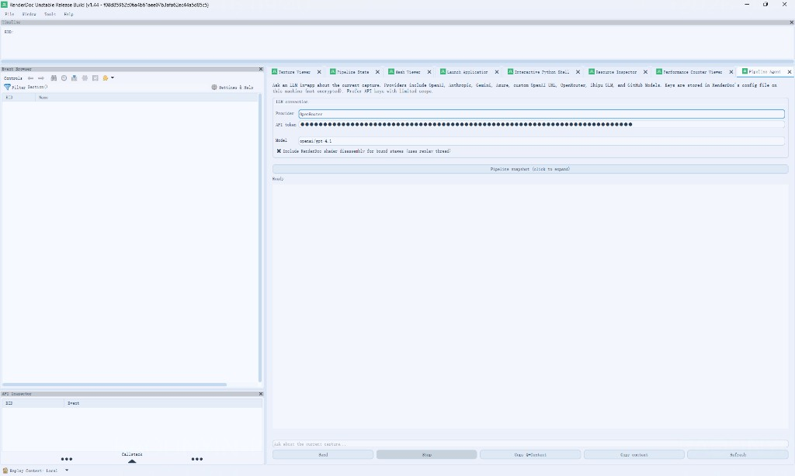

# RenderDoc · Pipeline Agent 分支

本仓库在 [RenderDoc](https://github.com/baldurk/renderdoc) 上游基础上，集成了 **Pipeline Agent**：在图形调试器内直接连接大模型，针对**当前已加载的 Capture** 提问，辅助阅读事件树、管线状态、Shader 反汇编，并支持让模型通过内置指令拉取指定 EID 的数据以梳理渲染管线。

> **说明**：以下为该 Agent 功能的用法说明。完整 RenderDoc 通用文档仍见上游 [renderdoc.org/docs](https://renderdoc.org/docs/) 与仓库内 [`docs/`](docs/)。

---

## Pipeline Agent 能做什么

- 在 **Tools → Pipeline Agent**（或主工具区对应页签）中打开面板。
- 选择 **Provider**（如 OpenAI、Anthropic、Gemini、Azure、OpenAI 兼容 URL、OpenRouter、智谱 GLM、GitHub Models 等），填写 **API Token**；**Model** 请从下拉项中选择各平台当前可用模型。
- 可选勾选 **Include shader disassembly**，在上下文中附带当前绑定阶段的反汇编（会走回放线程，可能略慢）。
- 在底部输入框用自然语言提问（例如：梳理本帧渲染管线、某 Pass 在做什么）。模型在需要时可输出形如 **`[FETCH_EID nnnn]`**、**`[SCAN_PASS nnnn]`**、**`[LIST_EVENTS]`** 的指令，由本地面板自动取数并多轮续写。
- 对话区支持滚动历史；回复里的 **`EID xxxx`** 可点击跳转到对应事件。
- **Send** 发送，**Stop** 中断长请求或多轮工具循环；**Ctrl+F** 在聊天中搜索；界面会显示 **Token 用量** 与当前**状态**（避免长时间无反馈）。
- **Pipeline snapshot** 可展开查看当前上下文字符串；**Copy context / Copy content** 便于复制到剪贴板。

API Key 会写入本机 RenderDoc 配置文件（**未加密**），请使用权限尽量小的密钥。

---

## 界面一览

  

上图为典型布局：**上方**为 Provider / Token / Model 与选项；**中部**可折叠 Pipeline 快照与对话区（含状态与 Token 统计）；**底部**为输入与发送、停止等按钮。

---

## 构建与运行

从源码编译方式与上游一致，请参阅 [`docs/CONTRIBUTING/Compiling.md`](docs/CONTRIBUTING/Compiling.md)。Windows 下通常使用 Visual Studio 打开生成目录中的解决方案并按说明配置 Qt 等依赖。

---

## 许可与上游

RenderDoc 本体以 **MIT** 许可发布，见 [`LICENSE.md`](LICENSE.md)。本分支的修改在相同许可前提下分发；使用时请遵守 RenderDoc 官方关于**仅调试自有程序**等政策说明。
