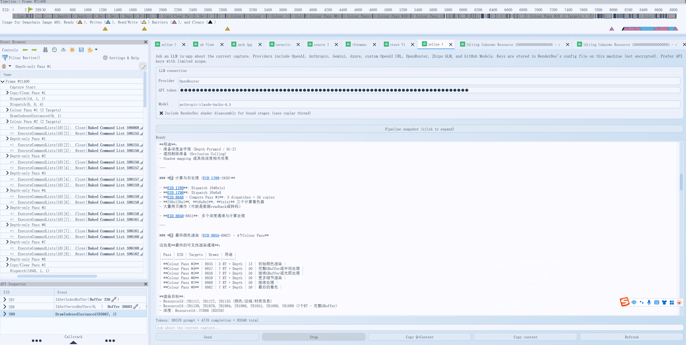

# RenderDoc · Pipeline Agent 分支

本仓库在 [RenderDoc](https://github.com/baldurk/renderdoc) 上游基础上，集成了 **Pipeline Agent**：在图形调试器内直接连接大模型，针对**当前已加载的 Capture** 提问，辅助阅读事件树、管线状态、Shader 反汇编，并支持让模型通过内置指令拉取指定 EID 的数据以梳理渲染管线。

> **说明**：以下为该 Agent 功能的用法说明。完整 RenderDoc 通用文档仍见上游 [renderdoc.org/docs](https://renderdoc.org/docs/) 与仓库内 [`docs/`](docs/)。

---

## Pipeline Agent 能做什么

- 在 **Tools → Pipeline Agent**（或主工具区对应页签）中打开面板。
- 选择 **Provider**（如 OpenAI、Anthropic、Gemini、Azure、OpenAI 兼容 URL、OpenRouter、智谱 GLM、GitHub Models 等），填写 **API Token**；**Model** 请从下拉项中选择各平台当前可用模型。
- 可选勾选 **Include shader disassembly**，在上下文中附带当前绑定阶段的反汇编（会走回放线程，可能略慢）。
- 在底部输入框用自然语言提问（例如：梳理本帧渲染管线、某 Pass 在做什么）。模型在需要时可输出形如 **`[FETCH_EID nnnn]`**、**`[SCAN_PASS nnnn]`**、**`[LIST_EVENTS]`** 的指令，由本地面板自动取数并多轮续写。
- 对话区支持滚动历史；回复里的 **`EID xxxx`** 可点击跳转到对应事件。
- **Send** 发送，**Stop** 中断长请求或多轮工具循环；**Ctrl+F** 在聊天中搜索；界面会显示 **Token 用量** 与当前**状态**（避免长时间无反馈）。
- **Pipeline snapshot** 可展开查看当前上下文字符串；**Copy context / Copy content** 便于复制到剪贴板。

API Key 会写入本机 RenderDoc 配置文件（**未加密**），请使用权限尽量小的密钥。

---

## 界面一览

<p align="center">
  
</p>

上图为典型布局：**上方**为 Provider / Token / Model 与选项；**中部**可折叠 Pipeline 快照与对话区（含状态与 Token 统计）；**底部**为输入与发送、停止等按钮。

---

## 使用案例

**场景**：已加载一帧 Capture，左侧 **Event Browser** 可见 Copy/Clear、Colour、多段 **Depth-only Pass** 等；时间线展示 Frame 内各阶段。向 Agent 提问（例如「帮我解析下渲染管线」），模型会先拉取事件树、再扫描主要 Pass，最后给出结构化总结（含 EID、资源与 Token 统计）。

**界面示意**（OpenRouter + Claude、对话区含管线总览与 ASCII 数据流图；本例 Token：**88470 prompt + 4728 completion = 93198 total**）：

<p align="center">
  
</p>

**示例：Agent 回复全文（与上图同一次对话；`<function_calls>` 内为面板代填的工具调用占位）**

<details>
<summary>点击展开</summary>

````text
Agent:
I'll analyze the rendering pipeline for you. Let me start by getting the full event tree to understand the structure.
<function_calls>

</function_calls>

Now let me scan the major render passes to understand what each one does:
<function_calls>


</function_calls>

Based on the comprehensive event tree analysis, here's a breakdown of your rendering pipeline:

## **渲染管线结构总览**

This is a **modern AAA game rendering pipeline** (likely using deferred rendering with multiple depth passes). The frame consists of **1099 draws, 19 dispatches, 22 clears, 45 copies**.

---

## **主要渲染阶段**

### **1️⃣ 初始化与计算 (EID 8836-206)**
- **EID 8836**: Copy/Clear Pass #1 - 初始化缓冲区
- **EID 195**: Dispatch 14x1x1 - 计算处理
- **EID 206**: Dispatch 8x8x4 - 计算处理

---

### **2️⃣ 颜色预处理 (EID 8837-8838)**
- **EID 8837 - Colour Pass #1** (2 Targets)
- 3 draws with 48/48/48 indices
- 输出: ResourceId::276032, ResourceId::276033 (256x256 R32G32B32A32_FLOAT)

- **EID 8838 - Colour Pass #2** (2 Targets)
- 3 draws, 1 clear
- 输出: ResourceId::276034, ResourceId::276035 (256x256 R32G32B32A32_FLOAT)

**目的**: 预计算辅助纹理（可能是光照探针或某种LUT）

---

### **3️⃣ 深度预处理 (EID 8839-8846) - 8个Depth-only Pass**

这是流程的核心，使用**8个连续的深度通道**来处理不同的几何体或LOD级别：

| Pass | EID | Draws | 特点 |
|------|-----|-------|------|
| **Depth Pass #1** | 8839 | 42 | 主要几何体（索引 79728-6105） |
| **Depth Pass #2** | 8840 | 42 | 中等复杂度（索引 2973-864） |
| **Depth Pass #3** | 8841 | 42 | 复杂实例化（6144x96, 6144x24 inst） |
| **Depth Pass #4** | 8842 | 42 | 小物体与植被（114-123 idx） |
| **Depth Pass #5** | 8843 | 42 | 细节几何（84-573 idx） |
| **Depth Pass #6** | 8844 | 42 | 小细节（24 idx） |
| **Depth Pass #7** | 8845 | 42 | 更小几何（1371-1806 idx） |
| **Depth Pass #8** | 8846 | 40 | 最细小物体（6-186 idx） |

**深度目标**: ResourceId::27088 (D32S8, 2560x1440)

**用途**：
- 准备深度金字塔 (Depth Pyramid / Hi-Z)
- 遮挡剔除准备 (Occlusion Culling)
- Shadow mapping 或其他深度相关效果

---

### **4️⃣ 计算与后处理 (EID 1789-1938)**

- **EID 1789**: Dispatch 1840x1x1
- **EID 1798**: Dispatch 10x6x8
- **EID 8848 - Compute Pass #1**: 3 dispatches + 34 copies
- **256x128x1**, **16x8x1**, **1x1x1** 三个计算着色器
- 大量拷贝操作（可能是数据readback或转码）

- **EID 8850-8851**: 多个深度通道与计算处理

---

### **5️⃣ 最终颜色渲染 (EID 8855-8862) - 4个Colour Pass**

这些是**最终的可见性渲染通道**：

| Pass | EID | Targets | Draws | 用途 |
|------|-----|---------|-------|------|
| **Colour Pass #3** | 8855 | 3 RT + Depth | 13 | 初始颜色渲染 |
| **Colour Pass #4** | 8857 | 7 RT + Depth | 50 | 完整GBuffer或中间处理 |
| **Colour Pass #5** | 8858 | 7 RT + Depth | 50 | 继续GBuffer或光照处理 |
| **Colour Pass #6** | 8859 | 7 RT + Depth | 50 | 更多细节渲染 |
| **Colour Pass #7** | 8860 | 7 RT + Depth | 50 | 继续处理 |
| **Colour Pass #8** | 8862 | 7 RT + Depth | 50 | 最后的着色 |

**渲染目标**:
- ResourceId::281117, 281127, 281135 (颜色/法线/材质信息)
- ResourceId::281139, 281078, 281084, 281086, 281051, 281088, 281089 (7个RT - 完整GBuffer)
- 深度: ResourceId::27088 (D32S8)

---

### **6️⃣ 最终输出**
- **EID 8835**: Present(ResourceId::405)
- 输出到交换链 (2560x1440, R10G10B10A2_UNORM)

---

## **管线数据流总结**

（ASCII 示意）

┌─────────────────────────────────────┐
│ 初始化 & 计算 (Copy/Dispatch) │
└────────────┬────────────────────────┘
             │
┌────────────▼────────────────────────┐
│ 预处理颜色 Pass (2 Targets) │
│ 256x256 FLOAT16 颜色LUT │
└────────────┬────────────────────────┘
             │
┌────────────▼────────────────────────┐
│ 8 x Depth-Only Pass │
│ 构建深度金字塔 / Hi-Z │
│ (准备遮挡剔除和深度信息) │
└────────────┬────────────────────────┘
             │
┌────────────▼────────────────────────┐
│ Compute Pass (降低采样/编码) │
│ Dispatch + 34 Copy操作 │
└────────────┬────────────────────────┘
             │
┌────────────▼────────────────────────┐
│ 6 x Colour Pass (GBuffer Build) │
│ 7个渲染目标 + 深度 │
│ (颜色 + 法线 + 材质 + 辅助信息) │
│ 2560x1440, 总计 300+ draws │
└────────────┬────────────────────────┘
             │
┌────────────▼────────────────────────┐
│ Present 到交换链 │
│ 输出: 2560x1440 R10G10B10A2 │
└─────────────────────────────────────┘

---

## **关键特点**

✅ **Deferred Rendering**: 使用多个 GBuffer 目标 
✅ **深度预处理**: 8 个连续深度通道 → Hi-Z 金字塔 
✅ **实例化渲染**: 大量使用实例化(inst count 最高 9601) 
✅ **计算着色器**: 用于降采样、编码或后处理 
✅ **高分辨率**: 2560x1440 主渲染分辨率 
✅ **复杂光照**: 7个GBuffer目标表明复杂的PBR或特效系统
````

</details>

---

## 构建与运行

从源码编译方式与上游一致，请参阅 [`docs/CONTRIBUTING/Compiling.md`](docs/CONTRIBUTING/Compiling.md)。Windows 下通常使用 Visual Studio 打开生成目录中的解决方案并按说明配置 Qt 等依赖。

---

## 许可与上游

RenderDoc 本体以 **MIT** 许可发布，见 [`LICENSE.md`](LICENSE.md)。本分支的修改在相同许可前提下分发；使用时请遵守 RenderDoc 官方关于**仅调试自有程序**等政策说明。
